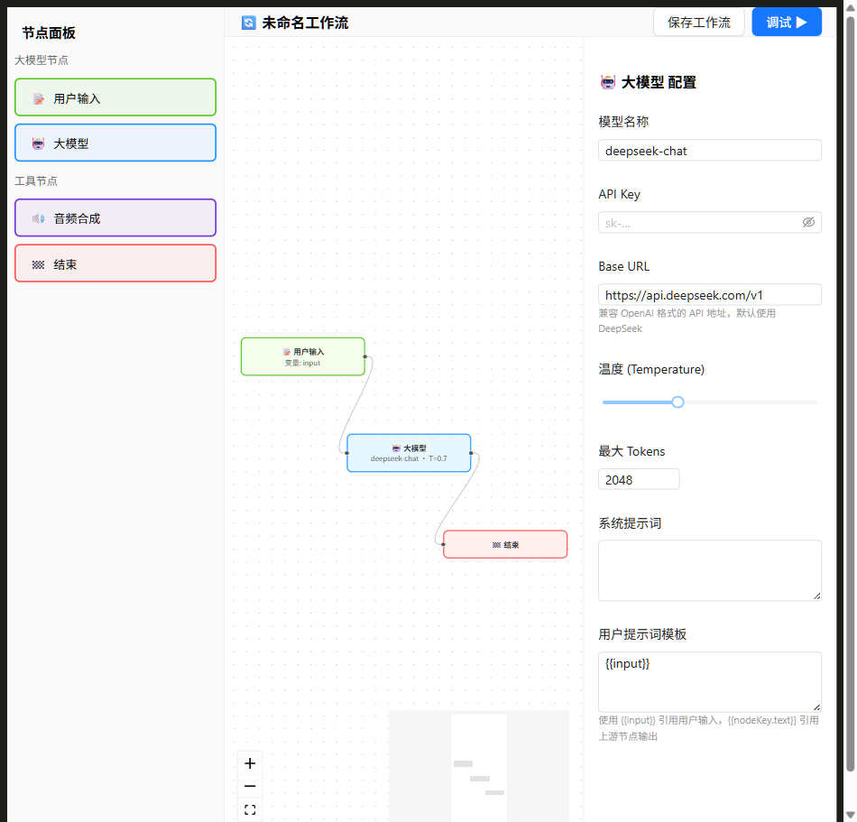
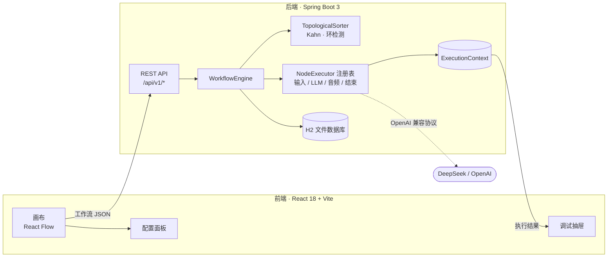
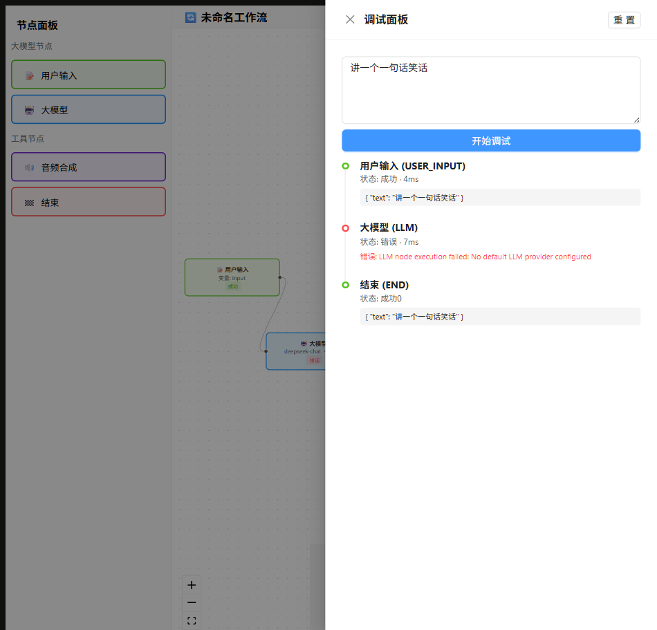

# AgentWeave

> **从零手写**的可视化 AI Agent 编排平台：拖拽节点、连线、配置参数即可搭建 AI 工作流，实时调试每一步的执行状态、输入输出与耗时。
>
> 前端 React 18 + React Flow，后端 Spring Boot 3 + 自研拓扑执行引擎 —— **引擎内核不依赖任何编排框架，全部手写**，适合想看懂工作流引擎原理的人。



## 🤔 为什么造这个轮子

Dify / n8n 很强大，但执行引擎是黑盒。AgentWeave 不追求大而全，核心只有三个**亲手实现**的模块，代码量小到几小时能读完：

- **拓扑引擎**：Kahn 算法拓扑排序 + 循环依赖检测，决定节点执行顺序
- **节点执行器**：策略模式注册表，每种节点一个执行器，加新节点 = 加一个类
- **执行上下文**：数据沿连线流动的"黑板"，调试时间线直接读它

## 🧭 当前进度

- [x] React Flow 可视化画布（拖拽 / 连线 / 配置面板）
- [x] Kahn 拓扑排序 + 环检测
- [x] LLM 节点（OpenAI 兼容协议：DeepSeek / OpenAI / 通义千问…）
- [x] 调试时间线（节点状态 / 耗时 / 输入输出 / 错误上报）
- [x] 工作流持久化（H2 内嵌文件库，零部署）
- [x] LLM Provider 管理接口
- [ ] 接入真实 TTS（音频节点当前为 Mock 模式）
- [ ] 条件分支 / 循环执行
- [ ] 自定义节点插件机制

## ✨ 功能特性

| | |
|---|---|
| **可视化画布** | 基于 React Flow 的拖拽式节点编辑器，数据沿连线自动流动 |
| **4 种节点** | 用户输入、大模型 (LLM)、音频合成（Mock）、结束 |
| **实时配置** | 点击节点即在右侧面板改参数，温度 / Tokens / 提示词模板 |
| **调试执行** | 一键运行，时间线逐节点展示成功 / 错误 / 耗时 |
| **拓扑排序** | 自动检测循环依赖，按正确顺序执行 |
| **多 LLM 服务** | 任何兼容 OpenAI `/chat/completions` 的服务即插即用 |

## 🏗 架构



> 详细设计见 [ARCHITECTURE.md](./ARCHITECTURE.md)。

## 🎮 界面预览

拖线搭好流程后点「调试」，输入测试文本立即执行：



图中时间线逐节点显示状态（成功 4ms / 错误 7ms）、输出数据与错误原因 —— 节点在画布上也会同步亮起状态角标。

## 🚀 快速开始

### 环境要求

| 依赖 | 版本 | 备注 |
|---|---|---|
| Java | **17+** | 推荐 [Temurin 17](https://adoptium.net/temurin/releases/?version=17) |
| Node.js | 18+ | |
| Maven | 3.9+ | |

> 🇨 **国内网络加速**（可选，装依赖更快）：
> ```bash
> npm config set registry https://registry.npmmirror.com
> ```
> Maven 在 `~/.m2/settings.xml` 配置阿里云镜像（[模板](https://developer.aliyun.com/mirror/maven)）。

### 1. 编译并启动后端

```bash
cd backend
mvn clean package -DskipTests
java -jar target/workflow-engine-1.0.0-SNAPSHOT.jar --server.port=8081
```

看到 `Started AiWorkflowEngineApplication` 即成功。

### 2. 启动前端

```bash
cd frontend
npm install
npm run dev
```

### 3. 打开浏览器

访问 **http://localhost:5173**

### 4. 跑通第一条工作流

1. 拖节点搭流程：`用户输入 → 大模型 → 结束`，从节点**右侧圆点**拖线到下一个节点**左侧圆点**
2. 点「大模型」节点，右侧面板填入你的 DeepSeek API Key（[申请入口](https://platform.deepseek.com/api_keys)）
3. 点「保存工作流」→「调试 ▶」→ 输入任意文本 →「开始调试」

## 📡 API 一览

| 方法 & 路径 | 作用 |
|---|---|
| `GET/POST /api/v1/workflows` | 工作流列表 / 创建（保存画布） |
| `PUT/DELETE /api/v1/workflows/{id}` | 更新 / 删除工作流 |
| `POST /api/v1/executions/debug` | **执行工作流（调试运行的入口）** |
| `GET /api/v1/executions/{executionId}` | 查执行记录与各节点结果 |
| `GET /api/v1/llm-providers` · `POST .../{id}/test` | Provider 管理 / 连通性测试 |

## 📁 项目结构（速览）

```
├── backend/src/main/java/com/ai/workflow/
│   ├── engine/          # ⭐ 自研执行引擎（拓扑排序 + 节点执行器 + 上下文）
│   ├── controller/      # REST API
│   ├── llm/             # OpenAI 兼容客户端
│   └── entity/ service/ # JPA 实体与业务层
├── frontend/src/
│   ├── components/      # 画布 / 节点 / 配置面板 / 调试抽屉
│   └── store/ services/ # Zustand 状态 + API 封装
```

完整目录树见 [ARCHITECTURE.md](./ARCHITECTURE.md)。

## ❓ 常见问题

**Q: 大模型节点报 `No default LLM provider configured`？**
在节点配置面板填入 API Key 即可（无需其它 Provider 配置），这是最常见的第一步卡点。

**Q: `mvn` 不是内部或外部命令？**
Maven 未装或未进 PATH。Windows 可到 [Apache Maven 官网](https://maven.apache.org/download.cgi) 下载 zip 解压后配置环境变量。

**Q: 端口被占用？**
```bash
netstat -ano | findstr :8081
taskkill /PID <PID> /F
```

**Q: 大模型调用超时？**
确认 Base URL 网络可达；默认 `https://api.deepseek.com/v1`。

**Q: 音频节点没有声音？**
当前为 Mock 模式（返回模拟 URL）。接入真实 TTS 修改 `application.yml`：
```yaml
audio:
  synthesis:
    provider: real
    api-url: https://your-tts-api.com/v1/synthesize
    api-key: your-key
```

## 🙏 致谢

- 学习参考：[二哥的 PaiAgent](https://gitcode.com/javabetter/PaiAgent)
- 画布引擎：[@xyflow/react](https://reactflow.dev/)　UI：Ant Design 5　后端：Spring Boot 3

## 📄 License

[MIT](LICENSE)
